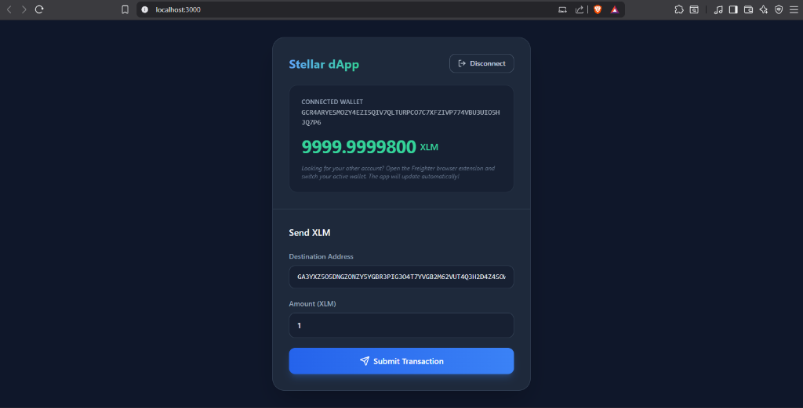
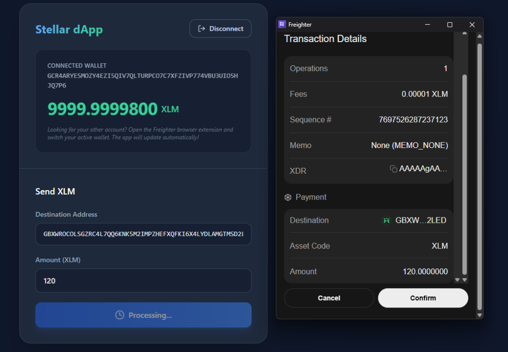
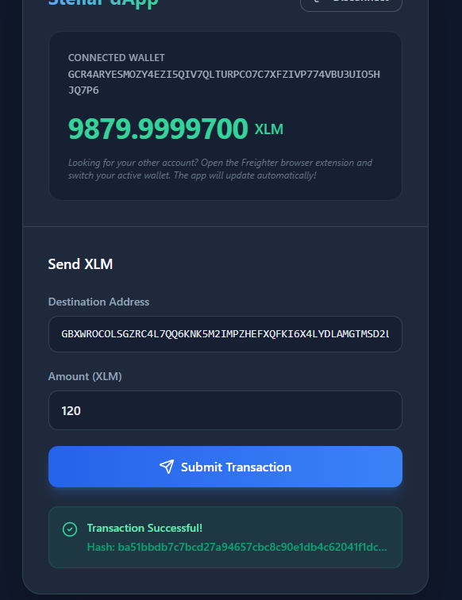

# Stellar Connect Wallet Challenge

A professional-grade decentralized application (dApp) developed on the Stellar Testnet. This platform enables users to securely integrate their Freighter wallet, monitor real-time XLM balances, and execute native transactions with comprehensive status tracking and feedback.

## Project Overview

The Stellar Connect Wallet is designed to provide a seamless interface for interacting with the Stellar blockchain. By leveraging the Freighter wallet extension and the Stellar SDK, the application ensures secure transaction signing without local private key storage.

### Key Features
- **Wallet Integration**: Secure handshaking with the Freighter browser extension, supporting dynamic account detection.
- **Real-Time Data**: Live balance fetching directly from the Stellar Testnet Horizon API.
- **Transaction Lifecycle**: End-to-end handling of native payments, including building, signing, and submission confirmation.
- **Robust Feedback**: A sophisticated UI state system providing clear updates during each stage of interaction.

## Setup Instructions

### Prerequisites
- Node.js (version 16.x or higher)
- [Freighter Wallet](https://www.freighter.app/) extension installed and configured for Testnet
- Testnet XLM (available via [Stellar Friendbot](https://laboratory.stellar.org/#account-creator?network=test))

### Local Installation

1. Clone the repository:
   ```bash
   git clone https://github.com/Harsheyz/Stellar-connect-wallet-challenge.git
   ```

2. Navigate to the project directory:
   ```bash
   cd Stellar-connect-wallet-challenge/stellar-connect-wallet
   ```

3. Install dependencies:
   ```bash
   npm install
   ```

4. Launch the development server:
   ```bash
   npm start
   ```

The application will be accessible at `http://localhost:3000` or `http://localhost:3001` depending on port availability.

## Screenshots

### 1. Wallet Connection State
Displays the interface after a successful connection, showing the masked public address to the user.


### 2. Balance Display
Illustrates the dynamically fetched XLM balance from the Stellar Testnet Horizon server.


### 3. Successful Testnet Transaction
Visual confirmation of a transaction being processed and signed through the Freighter wallet.


### 4. Transaction Result
The final state showing the unique transaction hash and confirmation of successful ledger inclusion.


## Technical Stack
- **Framework**: React 19
- **Styling**: Tailwind CSS / Vanilla CSS
- **Network Interface**: @stellar/stellar-sdk
- **Wallet Protocol**: @stellar/freighter-api

## License
This project is licensed under the MIT License.
